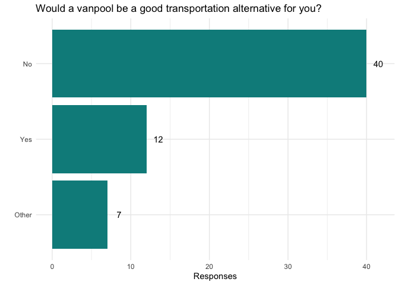

Fred Hutch Transportation Tech Survey Results
================
Compilied by Kirsten Cooper
Ver 1: 9/10/2020, Update: 10/19/2020

## TAG Survey Background

This survey was sent out Sept. 3, 2020 to a listserv of Fred Hutch
technicians. The language of the survey read *“The Technician Advocacy
Group (TAG) would like to gather data on how technicians and other
employees at the Hutch are potentially impacted by the newly reinstated
parking fees, as announced in the 8/31 Director’s Office COVID-19
Update. We appreciate your participation.”* This listserv was created 2
years ago, in collaboration with HR, so responses from newer technicians
were not captured.

The survey results were collected Sept 10, 2020, for presentation. By
the time of collection, there were 59 unique
responses

## Respondent Job Statuses

<!-- --><!-- --><!-- -->

The predominant job title of respondents was some variation of “Research
Technician”, which fits with listserv makeup. A majority of respondants
are considered an essential employee by the Hutch. 27% of respondants
are currently working on a project related to the COVID-19
response.

## Work locations

<!-- --><!-- -->

Due to COVID-19 restrictions, survey respondents are reducing their time
spent working on campus. A majority of respondants, however, are
continuing to work 5 or more days
onsite.

## COVID-19 Transportation Impacts

<!-- -->

<!-- --><!-- -->

Before COVID-19 restrictions, a majority of respondents commuted via
public transportation. Many have switched to driving a personal vehicle
into work, including employees who previously utilized a vanpoon or
carpool.

## Impact of Hutch Free Parking

<!-- -->

In the past month, the free parking offered by the Hutch has been highly
ultilized by survey respondents.

<!-- -->

A majority of survey respondents reported that the full price monthly
parking pass is a significant financial burden. There was an open
question on the survey: *"If the monthly parking pass fee is reinstated
at $135, how would this impact your current transportation needs?* Some
common responses are paraphrased below-

> I will need to find street parking nearby

> I will need to buy a monthly pass and deal with the financial costs

> Public transit options significantly increase commute times,
> particularly with reduced routes

Many respondents reported being uncomfortable with reverting to taking
public transit during a global pandemic. Some reported living with
high-risk individuals. Others reported fears of unintentially exposing
their lab members.

<!-- -->

## Parking Alternatives

In the survey, we asked respondents if they would be in support specific
alternatives to the full rate monthly parking.

<!-- -->

We asked for further clarification from respondents who reported than a
vanpool would not be a good option for them. The most consistant
response was that respondents didn’t work consistant hours. This is a
reality for many technicians, as they need to be able to process
clinical samples or work during non-peak hours for specific experiments.
When asked *“Would you consider a vanpool if the Hutch assisted in
matching up vanpool users?”*, most respondents answered in the negative
due to these scheduling issues.

<!-- -->

A majority of respondents were in support of a sliding scale for the
monthly parking fee. Most technicians are paid less than post-docs, thus
the reduced rates is, at best, a confusing policy.

A few respondents proposed daily parking rates in addition to monthly
parking passes.

The survey also asked *“From DO email:”If you are on campus part-time
and find another person who works on opposite days, starting on October
1, you can share a permit and split the costs evenly via payroll
deduction. If more than two people want to share a single permit, that
is possible, but payroll deduction can only be split between two
individuals. Only one person can park per day." Would a shared parking
pass be a good transportation alternative for you? If not, please
explain."* Responses varied, but a majority of respondents reported
being unable to share a parking pass, as they work full-time onsite.

Respondents were given an opportunity to share additional thoughts on
the resumed parking fees. Below are selected responses.

> “The decision is going to effect the lowest paid and highest risk
> employees the most. If public transportation is safe to take, and the
> Hutch feels safe with most of their essential on campus employees
> being required to bus everyday, then it is important to show data on
> the safety of public transportation during a pandemic.”

> “I was under the impression that parking rates were to encourage use
> of public transit and vanpool/carpool options in order to reserve the
> use of limiting parking spaces to those who needed them. It is
> disappointing to see parking rates go back in to effect when there are
> plenty of parking spaces available and there are restrictions/concerns
> on using public transit and vanpools. It does seem to
> disproportionately affect employees who must be on campus to do their
> work.”

> “Reinstating garage parking all the way up to $135/month in the middle
> of a global pandemic and economic depression feels like Fred Hutch is
> broadening the socioeconomic class divide and, frankly, abandoning its
> most vulnerable members. I know that Fred Hutch is struggling
> financially, and that very difficult decisions need to be made. I know
> other companies have made similar decisions without any sympathy for
> their employees. But working at a company where our goal is first and
> foremost health for all, it truly hurts that many of us are
> essentially being told that if we do not have enough money, we have to
> give up the health of ourselves and our loved ones.”

## October Transportation Changes Update

Transportation sent out an update in mid-September that kept surface lot
parking free for employees until King County enters Phase 3. We sent a
follow-up email to survey respondents to gage the impact of these
changes to their work commute.

The number of respondents for the second survey was low (8 out of 23
contacted), but still informative of the minimal impact these parking
changes have on commutes. 7 out of 8 respondents reported that there are
not enough surface lot parking spots to cover the demand. Several
respondants reiterated the need for a tiered parking cost system, as
currently afforded to graduate students and post docs.

Below are survey respondants comments on the Hutch parking fees and
transportation options.

> Any kind of sliding scale for lower income employees would be a
> welcome notification. The surface lots are full by 8:00 am and the
> nearest free street parking is about a 20 minute walk away. The
> parking garages have been extremely empty since the change, clearly
> most of those who have parking permits are not having to park on
> campus daily.

> The surface lots have all been filled earlier and earlier each day. On
> 10/8, they were filled by 8:10am. I’m already required to carpool to
> increase the chances of finding a parking spot (less cars overall in
> the lots). Transportation has not yet been able to hand out carpooling
> permits that I (and others) have requested (I assume due to being
> overwhelmed with the influx of parking requests). When I can’t
> carpool, I park ~15 min walk away from campus in the few free parking
> spots in Eastlake. These also require me to get to work ~30-45min
> before my usual starting time in order to find a spot.

> There are very minimal parking spots available on surface lots. And
> parking in the garages costs 4% of my salary\! That’s more than I put
> towards retirement at the moment. Parking should be made more
> affordable for lower-income full-time employees (tiered system) and
> not appeal only to the folks who make twice as much. I spent over 25
> minutes today looking for a spot only to end up parking on the street.
> This seems to be a daily occurrence since the new changes took place.
> Public transit and carpool/vanpool just isn’t an option for me right
> now either unfortunately. I’ve tried really hard to find people to
> transport with in my area but the folks who are on rideshare are
> currently either at capacity due to the virus or they are now working
> at home indefinitely.

> Technicians must be eligible for the same discounted rate that
> graduate students and post-docs enjoy.

> I ended up sharing a permit with a coworker. However, our PI is
> helping us with funding parking permits as well, and that is what
> really helps. I didn’t want to use the surface lot because I am able
> to share and because of the assistance from our PI – I want to leave
> those spaces open for people who don’t have the benefits that I do.

> The recent changes do not offer a permanent solution to tech’s, who
> make a significant less amount annually and are required to be on
> campus to do their work. Even once the phases change, we’re back to
> square one because parking will then be charged once again. We are
> looking for a permanent solution that will create fairness. A tiered
> system in cost is what we are looking for.
